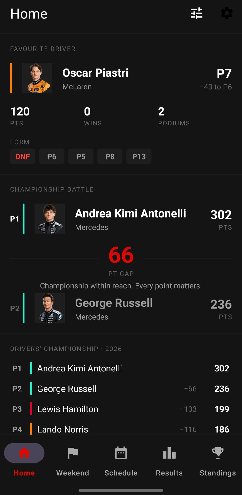
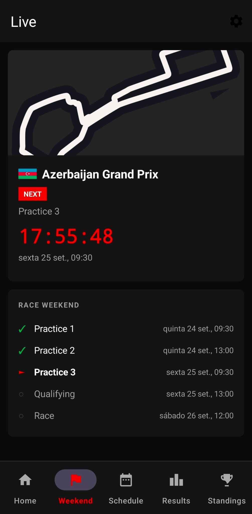
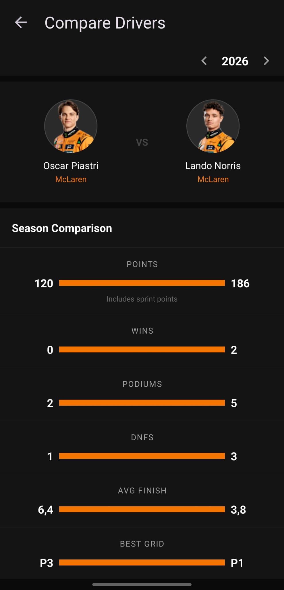
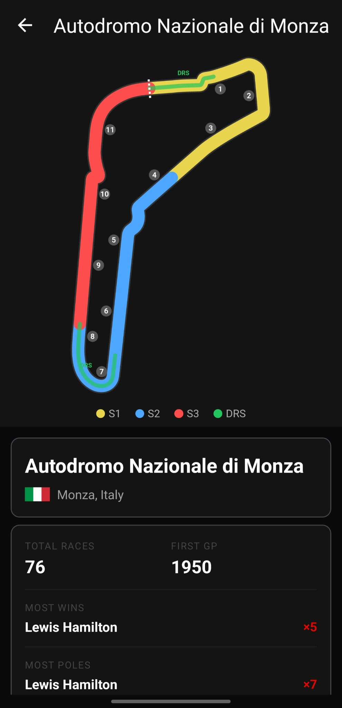

# F1 Stats

A personal Formula 1 companion app for Android, backed by a small Python API. It brings together the race weekend schedule, results, standings, driver and circuit history, head-to-head comparisons, weather forecasts and news, on a Home screen you can arrange the way you like.

The Android app is written in Java with Material 3. The backend is a FastAPI service that combines data from the Jolpica F1 API, OpenF1 and Open-Meteo, caches it, and serves it to the app as clean JSON.

| Home | Weekend | Head-to-head | Track detail |
|------|---------|--------------|--------------|
|  |  |  |  |

## Features

### Customizable Home
Home is a list of cards. Show, hide and reorder them from the Customize screen, and set per-card options such as your favourite driver or team.

| Card | What it shows |
|------|---------------|
| Next race | Countdown to the next session, circuit image and the weekend timeline |
| Championship battle | The leader, second place and the points gap |
| Last winner | The winner of the most recent race |
| Favourite driver | Championship position, points, gap to the driver ahead, wins, podiums and recent form |
| Favourite team | Constructor position, both drivers' points and their teammate head-to-head |
| Pinned head-to-head | A compact comparison of any two drivers |
| Championship snapshot | Top five drivers or constructors, plus your favourite if they are further down |
| Weekend forecast | Daily and per-session forecast for the next race weekend |
| News | Latest headlines from major F1 outlets, opening in the browser |
| This week in history | Races held around today's date in past seasons, with their winners |

### Race weekends and results
- **Weekend tab:** the current or next race weekend at a glance.
- **Schedule:** the full calendar for any season, with session times in your local time zone.
- **Results:** race, qualifying and sprint classifications for every round since 1950.
- **Round detail:** race, qualifying and sprint results and the starting grid, plus tyre strategy, pit stops and session weather (2023 onwards). An Analysis tab charts every driver's position lap by lap and compares lap times for the drivers you pick (1996 onwards), and lists each driver's pit stops (2011 onwards).

### Standings and comparisons
- **Standings:** driver and constructor standings for any season.
- **Driver profiles:** headshot, season statistics and race-by-race results.
- **Head-to-head:** compares two drivers in a season on points (including sprints), wins, podiums, DNFs, average finish, best grid, poles and race head-to-head.

### Circuits and widget
- **Track detail:** an interactive circuit map, plus circuit history: total races, most wins, most poles, most constructor wins and the race lap record. A pit strategy trend shows the average number of stops per finisher in recent races there, and the latest race's fastest stop.
- **Home-screen widget:** a countdown to the next session.

## Architecture

```
Jolpica F1 API ──┐
OpenF1         ──┼──▶ FastAPI backend ──▶ REST / JSON ──▶ Android app
Open-Meteo     ──┤    (TTL caches,                         (MVVM, Room cache)
News RSS feeds ──┘     SQLite cache)
```

**Backend.** The backend is the only component that talks to external services. It handles:
- normalising responses into stable Pydantic models
- respecting each source's rate limits
- caching results with time-to-live rules that match how often the data changes

When a source fails, it returns HTTP 502 rather than an empty success, so clients never mistake an outage for "no data".

**Android app.** Data flows through a single repository into a shared ViewModel. Room acts as a local cache:
- Historical results are stored permanently.
- Results for the current season are stored only after a session has finished, and recent rounds are refreshed for a few days to pick up post-race penalties.
- When the network is unavailable, the app shows the last data it stored.

## Tech stack

| Area | Technologies |
|------|--------------|
| Android | Java, Material Design 3 (dark theme), MVVM with LiveData, Room, Retrofit, OkHttp, Gson, Glide, Navigation Component, Facebook Shimmer, MPAndroidChart, AndroidX Browser |
| Backend | Python 3.11+, FastAPI, Uvicorn, httpx, Pydantic, aiosqlite, APScheduler, slowapi, feedparser, python-dotenv |
| Quality | pytest, respx, ruff, JUnit, GitHub Actions |
| Hosting | Docker, Koyeb |

## Getting started

### Prerequisites
- Python 3.11 or newer
- Android Studio (recent stable release) with the Android SDK
- An Android device or emulator running Android 8.0 (API 26) or newer

### Backend

```bash
cd backend
python3 -m venv .venv
source .venv/bin/activate        # Windows: .venv\Scripts\activate
pip install -r requirements-dev.txt
cp .env.example .env
python -m uvicorn app.main:app --reload --port 8000
```

The API is then available at `http://localhost:8000`, with interactive documentation at `http://localhost:8000/docs`.

Environment variables (all optional):

| Variable | Default | Purpose |
|----------|---------|---------|
| `OPENF1_TOKEN` | empty | OpenF1 sponsor token. Enables live session polling; without it, only historical OpenF1 data is used |
| `DB_PATH` | `data/f1_data.db` | Location of the SQLite cache |
| `LOG_LEVEL` | `INFO` | Python logging level |

To run the backend in Docker instead:

```bash
docker build -t f1-stats-backend backend
docker run -p 8000:8000 --env-file backend/.env f1-stats-backend
```

### Android app

1. Open the `android/` folder in Android Studio.
2. Set the backend URL in `android/gradle.properties`. It must end with a slash:
   ```properties
   F1_BACKEND_URL=https://your-backend.example.com/
   ```
3. Build and run the `app` configuration on a device or emulator.

You can also change the backend URL at runtime in **Settings**, for example to point the app at a different deployment. Release builds require HTTPS. Debug builds also allow plain HTTP, so you can point the app at a local backend, for example `http://10.0.2.2:8000/` from the Android emulator.

## Testing

```bash
# Backend tests and lint
cd backend
.venv/bin/python -m pytest -q
.venv/bin/ruff check .

# Android unit tests
cd ../android
./gradlew :app:testDebugUnitTest
```

GitHub Actions runs the backend lint and tests on every push and pull request to `main`. Lint failures block the build.

## Deployment

The backend is deployed to [Koyeb](https://www.koyeb.com) as a Docker service built from the `backend/` directory, and redeploys automatically on every push to `main`.

On Koyeb's free tier, the instance scales to zero after an hour without traffic:
- **Cold starts:** the first request after a pause takes a few seconds. The app uses generous timeouts and one retry to absorb this.
- **Disk:** the local disk does not survive a pause, so SQLite is used only as a cache that can always be rebuilt.
- **Scheduled jobs:** these only run while the instance is awake, so they are best-effort. Correctness relies on the TTL caches, not on scheduled jobs.

The service is a standard Docker container, so it runs equally well on Fly.io, a small VPS or a Raspberry Pi.

## API overview

| Endpoint | Description |
|----------|-------------|
| `GET /schedule?year=` | Season calendar with sessions and circuit details |
| `GET /schedule/next` | The next race weekend |
| `GET /schedule/upcoming-sessions?days=` | Sessions starting in the next few days (default 14, at most 30) |
| `GET /results/latest?session_type=&year=` | Results of the most recent completed round |
| `GET /results/{year}/{round}?session_type=` | Race, qualifying or sprint results |
| `GET /standings/drivers?year=` | Driver standings |
| `GET /standings/constructors?year=` | Constructor standings |
| `GET /drivers/{year}` | Drivers of a season with headshots and team colours (2023+) |
| `GET /meetings?year=` | OpenF1 meetings with circuit images and flags (2023+) |
| `GET /session-key/{year}/{round}` | OpenF1 session key for a round |
| `GET /sessions?year=&session_type=` | OpenF1 sessions (2023+) |
| `GET /sessions/{session_key}/...` | Laps, fastest laps, stints, pit stops, race control, weather and drivers for a session |
| `GET /live` | Snapshot of the latest session |
| `GET /live/{session_key}` | Snapshot of a given session |
| `GET /circuit/{circuit_id}/stats` | Circuit history and records |
| `GET /weather/{year}/{round}` | Race weekend forecast |
| `GET /news?limit=` | Latest F1 headlines |
| `GET /history/on-this-day?date=&window=` | Races held around a given date in past seasons |

The full, interactive reference is available at `/docs` on any running backend.

## Data sources and credits

This project is built on the work of the following data providers. Please respect their terms if you reuse it.

| Source | Used for | Licence or terms |
|--------|----------|------------------|
| [Jolpica F1 API](https://github.com/jolpica/jolpica-f1) | Schedule, results, standings and circuit history since 1950 | CC BY-NC-SA 4.0, non-commercial |
| [OpenF1](https://openf1.org) | Session data, headshots, team colours, circuit images (2023+) | Unofficial API, CC BY-NC-SA 4.0, non-commercial |
| [Open-Meteo](https://open-meteo.com) | Weather forecasts | CC BY 4.0, non-commercial use of the free API |
| [julesr0y/f1-circuits-svg](https://github.com/julesr0y/f1-circuits-svg) | Circuit layouts | CC BY 4.0 |
| [Flagpedia](https://flagpedia.net) | Country flag images | Free to use |
| Autosport, Motorsport.com, The Race | News headlines (headline, source and link only) | Content belongs to each publisher |

The bundled file `backend/app/data/race_winners.json` is derived from Jolpica data and is shared under the same CC BY-NC-SA 4.0 licence. It can be regenerated with `backend/scripts/build_race_winners.py`.

## Known limitations

- **OpenF1 coverage:** OpenF1 covers 2023 onwards. Headshots, tyre strategy, pit stops and session weather are not available for earlier seasons.
- **Live timing:** this requires a paid OpenF1 subscription and is disabled by default.
- **Circuit statistics:**
  - "Poles" counts drivers who started from grid position one.
  - The lap record is the fastest race lap since 2004, the first season with fastest-lap data. It may not match the official record for circuits whose layout has changed.
- **Weather forecasts:** these become available about 15 days before a race weekend.

## Roadmap

- Lap time and position charts
- Pit stop history per circuit
- Corner-annotated, sector-coloured track maps generated from position data
- Notifications and a widget for your favourite driver

## Licence

The source code is released under the [MIT Licence](LICENSE). Data from the third-party sources above is covered by their own licences, not by the MIT Licence.

## Disclaimer

This is an unofficial personal project and is not associated in any way with the Formula 1 companies. F1, FORMULA ONE, FORMULA 1, FIA FORMULA ONE WORLD CHAMPIONSHIP, GRAND PRIX and related marks are trade marks of Formula One Licensing B.V.
